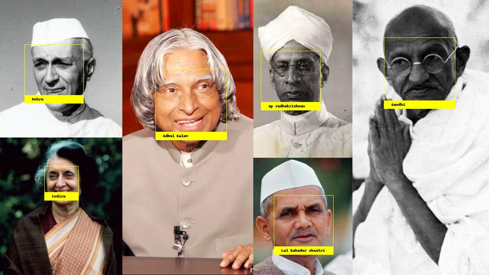

# face-recognition
This is an implementation of python's face recognition module, loaded with known faces of Indian national leaders.

# output of sample:
 </img>

# steps to run:
### 1. create an virtualenv,
### 2. RUN "python identify.py" on Command line
