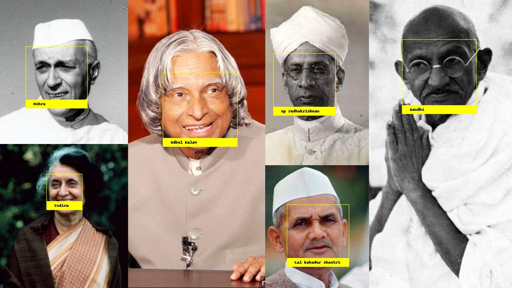

# face-recognition
This is an implementation of python's face recognition module, loaded with known faces of Indian national leaders.

# output of sample:
 </img>

# steps to run:
### 1. create a virtualenv,
### 2. Install face_recognition module : "pip install face_recognition"
### 3. RUN "python identify.py" on Command line
